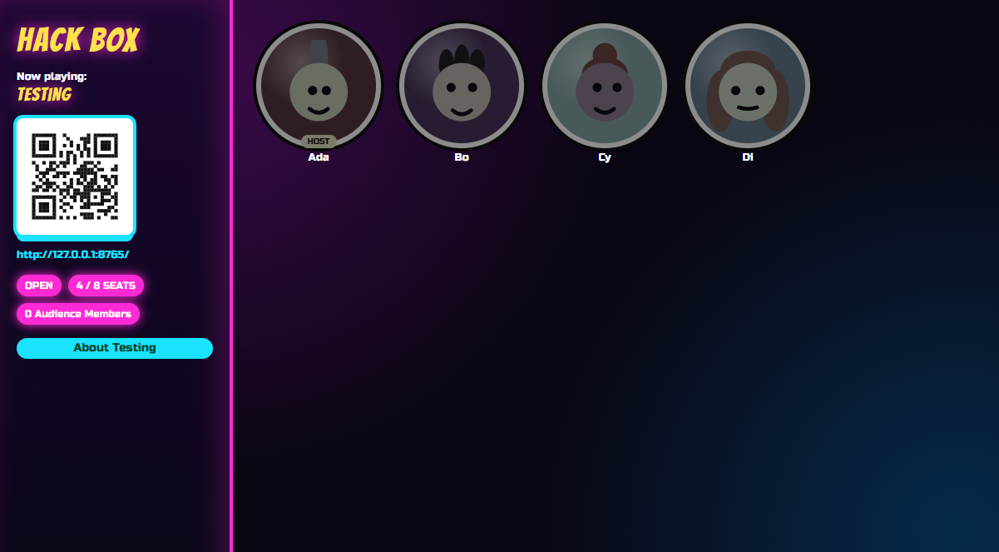
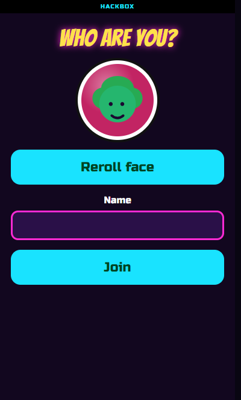

# Hackbox

A room, a TV, and a pile of phones. Hackbox is a Go host that puts the game on the big screen and the buttons in everyone's pocket.

One process. Same Wi-Fi. Browser only. No app store, no cloud account, no room code on someone else's website.

The cabinet is neon on purpose. The first compiled-in package is Testing. It is a diagnostics table, not a trivia night. Party games land in `internal/games/` the same way.



The board is `/board`. Fullscreen that on the TV. The QR is the join URL for phones.



Join is a face, a name, and one button. The first person who also types the admin password becomes the claimed host.

## Contents

- [What you get](#what-you-get)
- [Status](#status)
- [Run a room](#run-a-room)
- [Write a game](#write-a-game)
- [Docs](#docs)
- [Tests](#tests)
- [License](#license)

## What you get

- A Windows PC that stays on for the party. That machine is the server. Closing the console ends the room.
- A TV board at `/board` with seats, a QR, and the join URL.
- Phones as controllers. Players scan the QR, pick a face, type a name, tap Join.
- A claimed-host phone with Load, Start, Pause, Stop, kick, and settings.
- Room state in SQLite. Quit and come back, then Keep this room or Clear room.
- Two palettes, `neon-light` and `neon-dark`.
- Operator docs inside the binary at `http://127.0.0.1:8654/docs`.

What it is not:

- A catalog of party games yet. Testing is what ships so the host wiring can be poked.
- A phone app. Players use a browser.
- A public matchmaking service. Default night is LAN. Advertised hostname is only for a tunnel you set up yourself.

## Status

This is still moving. Interfaces can change. There is no "forgot password" in the binary yet. Write the admin password down.

Games are compile-time. A package under `internal/games/<name>` calls `games.Register` from `init`. Host blank-imports it. There is no runtime folder scan and no separate game binary.

## Run a room

You need Go 1.26 or newer, a Windows computer, a TV or second window, and phones on the **same Wi-Fi** as the PC. Guest Wi-Fi often blocks this.

```text
git clone https://github.com/KroniK907/hackbox.git
cd hackbox
go run ./cmd/hackbox
```

Or build a binary and double-click it:

```text
go build -o hackbox.exe ./cmd/hackbox
.\hackbox.exe
```

Leave the console window open. Hackbox always binds port **8654**. If another copy is already running, this one prints an error and exits.

On the host machine, open `http://127.0.0.1:8654`. First visit is setup. Pick an admin password (at least 8 characters), tap Finish, fullscreen `/board` on the TV.

Phones use the URL or QR on the board. They must not use `127.0.0.1`. That address is this device, so a phone would look for Hackbox inside itself.

The step-by-step operator guide is [How to run Hackbox](docs/index.html). After the process starts it is also `http://127.0.0.1:8654/docs`.

Room files live under `%LOCALAPPDATA%\hackbox` (`host.sqlite`, optional `host.log`, a `games` folder per game id).

## Write a game

A game is a Go package that implements `games.Game`. Host calls Load, Start, Pause, Resume, Stop, Shutdown. The game renders the TV through `Board` and the phones through `Phone` / `Play`. Persistence goes through Helper (`KVGet` / `KVSet`, `DataDir`). Live updates go through `Publish` on the lobby SSE hub.

The shipped reference is [Testing](internal/games/testing). Copy that shape. Register in `init`, then blank-import the package from `internal/host/handler.go` so the catalog sees it.

```text
# after you add the package and the blank import
go test ./internal/games/... ./internal/host/...
go run ./cmd/hackbox
```

Load the game from the Host drawer. Start needs at least one seated player.

## Docs

| Page | Who it is for |
| --- | --- |
| [How to run](docs/index.html) | Person with the PC. Also `GET /docs`. |
| [Game API reference](docs/game-contract.html) | Human writing a package. Signatures, examples, SSE. Also `GET /docs/game-contract.html`. |
| [Game / host contract](docs/agent/GAME_CONTRACT.md) | Agent (and anyone who wants the short tables). |
| [Codebase layout](docs/agent/CODEBASE.md) | Packages, embeds, import rules. |

`docs/*.html` files carry their own CSS. Host serves the embedded bytes. It does not restyle them through `live.css`.

## Tests

```text
go test ./...
```

Tests sit next to the code they cover. Prefer `package foo_test` unless a test must see unexported details.

## License

[GNU GPLv3](LICENSE).
